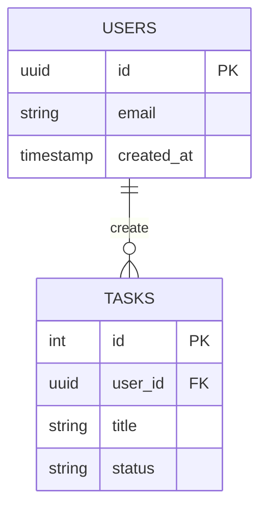

# 🗄️ Schema do Banco de Dados

Descreva aqui o dicionário de dados do banco de dados do projeto **MotoristAI**.

## 📊 Diagrama ER (Sugerido)

```mermaid
erDiagram
    USERS ||--o{ TASKS : "create"
    USERS {
        uuid id PK
        string email
        timestamp created_at
    }
    TASKS {
        int id PK
        uuid user_id FK
        string title
        string status
    }
```
